<div align="center">


[](https://github.com/certus-sec/pool1337)

<p align="center">
  
  &nbsp;&nbsp;&nbsp;
  
</p>

---

# school badges
<a href="https://1337.ma"></a>
<a href="https://42network.org"></a>


---

# live repo stats


</div>

<br/>

---

<div align="center">


</div>

<div align="center">


</div>

<div align="center">

</div>

---

## modules

> **8 / 14 complete** — C00 through C07 fully solved and norminette-checked.

<p align="center">
  
</p>

<p align="center">
  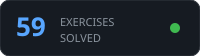
  
</p>

| Module | Status |
|:------:|:------:|
| **C00** |  |
| **C01** |  |
| **C02** |  |
| **C03** |  |
| **C04** |  |
| **C05** |  |
| **C06** |  |
| **C07** |  |
| **C08** |  |
| **C09** |  |
| **C10** |  |
| **C11** |  |
| **C12** |  |
| **C13** |  |
---

## shell · exams · rush

| | | status |
|:-:|---|:-:|
| 🐚 | **Shell00** — fs navigation · git · permissions | ⬜ not started |
| 🐚 | **Shell01** — scripts · symlinks · automation | ⬜ not started |
| 📋 | **Exam level00** — 6 exercises | ✅ done |
| 📋 | **Exam level01** | ⬜ planned |
| 📋 | **Exam level02** | ⬜ planned |
| 📋 | **Exam level03** | ⬜ planned |
| 👥 | **Rush00** — weekend team project | ⬜ not started |
| 👥 | **Rush01** — advanced teamwork | ⬜ not started |

---

## the rules

42 enforces a strict coding standard called **Norminette** — every file in this repo passes it.

```c
/*
**  norminette constraints
**  ─────────────────────────────────────────
**  function body      →  25 lines max
**  declared variables →  5 per function
**  loops              →  while only  (no for)
**  assignments        →  never inside conditions
**  forbidden          →  printf · global vars
**  memory leaks       →  zero tolerance
*/
```

```bash
# verify norm
norminette ./days/C00/ex00/ft_putchar.c

# compile with full warnings
cc -Wall -Wextra -Werror ft_putchar.c -o out

# check for leaks
valgrind --leak-check=full --track-origins=yes ./out
```

---

## structure

```
pool1337/
├── days/
│   ├── C00/   ex00 → ex08   write · loops · output
│   ├── C01/   ex00 → ex08   pointers · arrays
│   ├── C02/   ex00 → ex12   string manipulation
│   ├── C03/   ex00 → ex05   string comparison
│   ├── C04/   ex00 → ex05   base conversion · atoi
│   ├── C05/   ex00 → ex08   recursion · math
│   ├── C06/   ex00 → ex03   argc / argv
│   └── C07/   ex00 → ex05   malloc · free
├── sources/   notes.md + video.md per module
├── EXAM/      level00 → level03
└── tools/     42header · moulinette · norminette
```

---

## quick start

```bash
git clone https://github.com/certus-sec/pool1337.git
cd pool1337/days/C00/ex00
cc -Wall -Wextra -Werror ft_putchar.c && ./a.out
norminette ft_putchar.c
```

---

<div align="center">

<sub>author: <strong>sabir</strong> · school: 1337 / 42 network · benguerir, morocco · 2026</sub>

<br/><br/>


</div>
